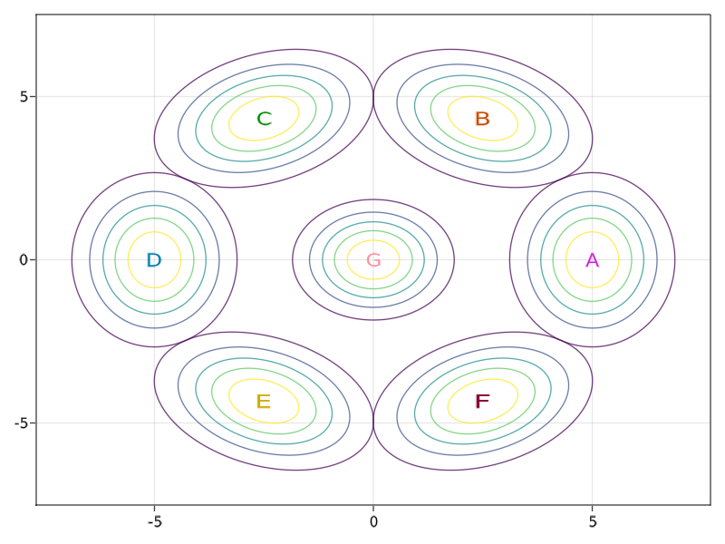

# Spectral clustering in Julia


Tested using Julia 1.6.2

To add the required dependecies one should be able run the code below (not tested). Note that it might take some time to install the packages and to run the script for the first time.
```
using Pkg
dependencies = ["GLMakie", "Statistics", "LazySets", "Distributions", "Clustering", "Colors", "GeometryBasics"]
Pkg.add(dependencies)
```
